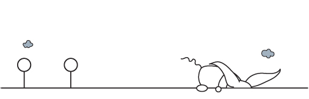
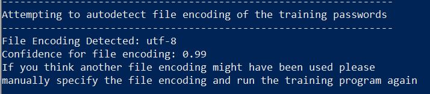
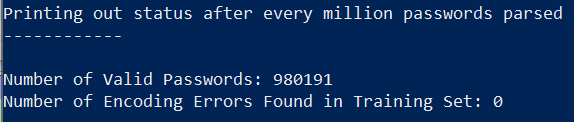
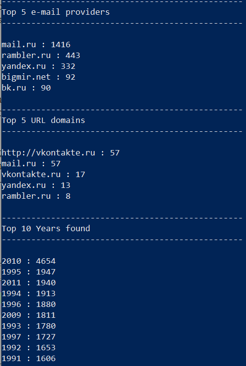
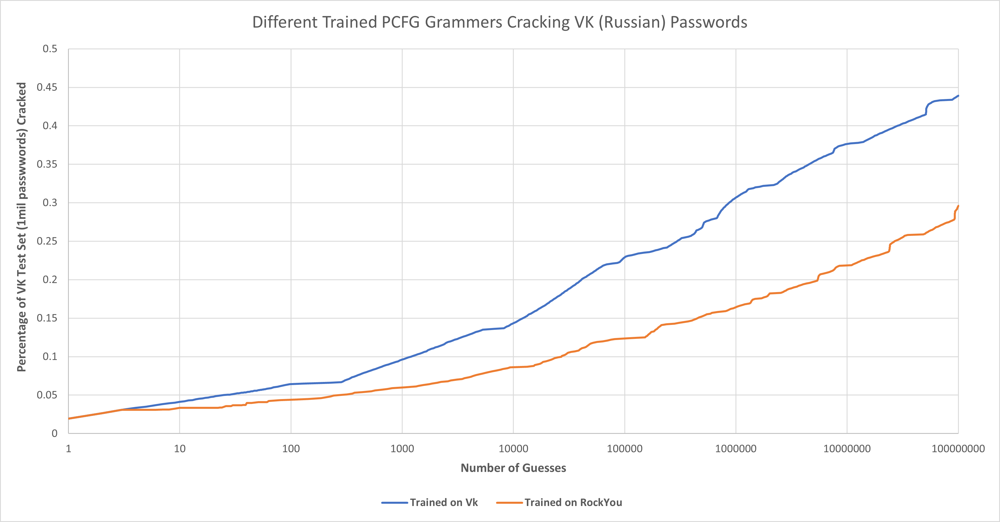
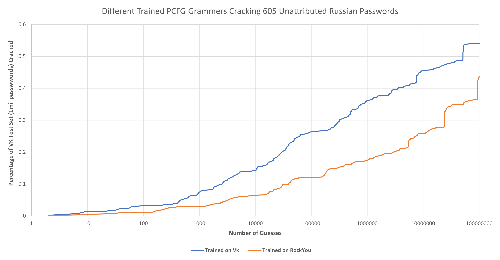

Overview:
---------

Part of the feature enhancements of Version 4.3 of the PCFG Toolset is enhanced non-ASCII character set support. To demonstrate this, I figured it was time to release a new ruleset trained on non-English passwords to to complement the "Default" ruleset which was trained on a subset of the RockYou passwords. Part of the challenge of training a PCFG ruleset is finding a set of passwords that pairs well with the training process. It helps if the ruleset is created from a set of plaintext passwords. This is because you can't train on passwords you haven't cracked. Duplicate passwords also results in a more effective PCFG Ruleset. Otherwise how will you know that '123456' is more common than '348251'? Also, public password dumps have a lot of ... for lack of a better term ... junk in them. So finding a publicly available password dump that is relatively clean can be challenging. Finally you want to have a training set that resembles passwords that you are trying to target. One password list that I have that meets many of those requirements is from VK.com which is the Russian equivalent of Facebook. The list I have was supposedly from a 2012 hack, (there's been other reported hacks, including one recently), and it made its way through many different hands before I was able to obtain a copy. To read more about the hack, here is a reference: https://thehackernews.com/2016/06/vk-com-data-breach.html. What's useful is that this list represents a good set of password for Russian speakers, the passwords are in plaintext, it includes duplicate passwords, and the copy I received seems to be relatively well formatted.

A quick note on ethics:
-----------------------

The password set I obtained did not include usernames or e-mail addresses. It only included the passwords. This was a bonus for me. I don't want to associate individual passwords with real people. While the PCFG grammar does a decent job of breaking down individual passwords, it does include private data in the generated ruleset that users included in their passwords. That's a big reason why I selected such an old set. All the passwords in the VK password list are at least 10 years old and have been extensively traded in underground circles. Therefore I believe the research use of such a ruleset outweighs the privacy impact of making portions of this list partially available in the PCFG code repository. I have also not validated that these passwords are real, and from the actual 2012 vk.com hack. In fact, there's no way for me to truly validate this list. Once again, I view this as a bonus. While there are indicators that this list is in fact legit, (which I'll talk about in the training portion of this chapter), this list could be a fabrication.

Pre-processing the List:
------------------------

Since I'm planning on releasing this ruleset as part of the PCFG code repository, I want to keep the generated grammar relatively small. To this end, I selected a one million password subset of the original vk.com list to use in training. Previous tests have shown that while larger training sets can help improve the effectiveness of PCFG grammars, the value of larger training sets diminishes drastically after the first million passwords. In fact, even training on only 100 thousand password can be quite effective, but one million is a nice pleasing sounding number. An added advantage of this approach is I can then the remaining passwords to run tests against.

One tool that I would highly recommend to clean up password lists before training on is: https://github.com/NetherlandsForensicInstitute/demeuk. If you want to crack passwords like Europol agents, Demeuk is the tool for you. It is very effective at fixing encoding issues, cleaning up weird junk that tends to show up in password lists, as well as tailoring the training set to the password policies you are targeting. I'm going to talk about Demeuk more later, but as some background, I did not use it for the Russian ruleset included in this repo. I went back and forth on this, but in this case the testing I did showed that the code cleanup options in the core-PCFG code were sufficient for processing the training list without using Demeuk.

Training on Vk Passwords:
--------------------------

To create the Russian ruleset, I ran the PCFG trainer and only specified the training list and the ruleset name. I left the rest of the options at their default settings.

.. code-block::

     python3 trainer.py -t vk_1m.txt -r Russian
     
Doing this told me a couple of things. The first thing was that the encoding of this dataset was likely UTF-8, which is really helpful since that makes it more widely applicable for other cracking sessions. Here is an output from my training session that shows that.

  
I've seen a number of other Russian password sets encoded as ISO 8859-5, or MacOS Cyrillic. This means converting your training set to the type of encoding you are targeting is very important. I'll cover that in more detail later. For now though, it's helpful to highlight that the Russian PCFG ruleset included in this code repo is made to target UTF-8 encoded passwords.

You can verify the auto-detected encoding by looking at the number of encoding errors encountered when parsing the entire password set. You can see that in the following screenshot that no encoding errors were encountered during the training process.

  
You might also notice that it only detected around 980 thousand valid passwords even through I passed it a training list of one million passwords. There's a number of reasons a line/password in the training list can be rejected, but the most common reason is the trainer will reject blank lines. This also means that a PCFG based attack will never guess a "blank" password. I've gone back and forth on if this is desired behavior or not, but given how messy training lists tend to be, rejecting blank lines generally seems to be the right call. This also means you might want to run a quick check to validate that a password exists and was not blank before running a PCFG based cracking attack.  Getting back to the VK list, I opened it up the training file troubleshoot this, and yes, it turned out that roughly 2% of the lines were blank. 

The final point I want to highlight about the training process is the statistics the trainer produces at the end. The following picture shows the statistics generated from training on the Vk list.

  
Looking at the e-mail list, it certainly appears this training list was created from Russian speakers. Side note, bigmir.net is a Kiev based Ukrainian site, which is a good reminder that just because a list is made up of Russian speakers, it doesn't mean they are all Russian users. 

Looking at the top five URLs, you might notice a number of the top e-mail providers there as well. This is a common occurrence I've seen across multiple different password dumps. Part of this is a limitation of the trainer. If the trainer parses username@mail.ru, the trainer can tell it is an e-mail account. If the trainer parses mail.ru though, that string without an '@' symbol looks like a URL. Probably the best way to handle this would be to identify e-mail providers during the first pass the trainer runs on the input list, but I haven't gotten around to implementing that yet. This is all a long way to say you can usually skip past e-mail providers in the URL domains. Looking at the remaining URLs, we can see that vkontakte.ru is highlighted, which gives further credence that this password list came from Vk. This approach is very useful for identifying where random password lists originated from, which is something I end up dealing with quite a bit.

When it comes to years, you'll notice that 2010 is the most common year, despite the fact that this list supposedly was stolen around 2012. This actually matches up with behavior seen in other password disclosures as well. You need to remember that unless a mandatory password change policy was in place, most of the passwords will have been created a year or two before the breach. Therefore you should expect a similar distribution. Opening up the Digits/1.txt file in the generated ruleset, I could see that 2012 was actually the 36th most common date found, with 2013 being the 76th most common date. This seems to validate the story that the password list was stolen in early 2012. The other point I'd like to raise is to highlight the prevalence of dates in the early 1990's. Since people tend to use their birthdays in their passwords, this implies that at the time of the theft, the user population skewed to be older teenagers to people in their early 20's.

Testing the Russian Ruleset
----------------------------

The next step was to test the effectiveness of the Russian ruleset. As mentioned earlier, I had divided up the VK list into 1 million password sized sub-lists, which allows running an initial test against a set of very similar, but different, users compared to the ones found in the training list. While it is certainly possible to use a traditional password cracking program to test the ruleset, I like to use the checkpass program which is part of: https://github.com/lakiw/Password_Research_Tools, since it allows me to graph the results. I then ran two cracking sessions using both the Russian ruleset, and the "Default" ruleset generated from RockYou. The following are the commands I used to test a cracking session of 100 million guesses:

.. code-block::

     python3 pcfg_guesser.py -r Russian | ../Password_Research_Tools/checkpass.py -t ../../research/password_lists/vk_1m-test-2.txt -m 100000000
     
     python3 pcfg_guesser.py -r Default | ../Password_Research_Tools/checkpass.py -t ../../research/password_lists/vk_1m-test-2.txt -m 100000000
     
And below are the results:

.. image:: image/vk_standard.png
  :width: 600
  :alt: Graph showing the Russian ruleset outperformed the Default Ruleset
  
As you can see, the Russian ruleset significantly outperformed the Default RockYou ruleset when targeting passwords created by Russian speakers. Here is the same graph on a logarithmic scale to better look at how it performed earlier in the cracking session.

  
It's still debatable if password distributions follow Zipf's law (https://en.wikipedia.org/wiki/Zipf%27s_law). Zipf's law is useful though as a general rule of thumb when analyzing the success, (and possible optimization), of password guessing strategies. For example, if Zipf's law held true, then an indicator that your password guesser is optimized correctly is if the line in a logarithmic graph is relatively straight, (and the steeper the incline the better). Looking at these results, you can see where the Russian ruleset for the PCFG guesser starts to perform better after 1000(ish) guesses. This implies that the Russian ruleset still isn't optimized for guesses early on. In addition, the overall results even using the Russian ruleset only cracked 44% of the test set. This is significantly less than I'd expected, as I was hopeful based on the target demographic and password policy that it would crack around 60%. Even considering 2% of the passwords in the test set were "blank" and thus won't be cracked, this is a mystery to me and something I plan on digging into more later. But considering it's been two years since my last release of the PCFG toolset I didn't want this analysis to hold publishing a new version.

To validate these findings, the next step was to test on a different set of Russian passwords. For this test, I ran an attack against 605 unattributed Russian passwords I had obtained using the same settings as I had done against the VK test set. The results are below:

.. image:: image/605_russian_standard.png
  :width: 600
  :alt: Graph showing the Russian ruleset still outperforms the Default ruleset against a different set of passwords
  

  
This time, the results were better, but still not where I'd like them to be. It did validate the earlier test, as the Russian ruleset continued to outperform the RockYou ruleset. As with targeting the VK set though, you can see on the logarithmic graph that the PCFG didn't start behaving as expected until around 1000(ish) guesses again. 
