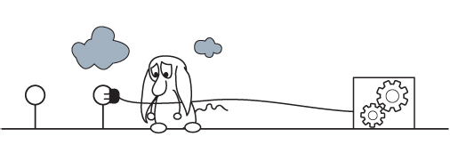

Honeywords Overview
-------------------

**Definition:** Honeywords are synthetic, (computer generated), passwords that attempt to look like passwords created by humans

**Why would you want honeywords?**

Good question! I'll admit the main reason I've worked on honeywords is they are essentially "free" research since a PCFG grammar that can generate a realistic looking synthetic password list also helps cracking passwords with a PCFG. To put it another way, a perfect honeyword generator would also be a very effective password cracker. Also, it gave me a chance to collaborate with Ron Rivest, and you just can't say no to that. The reason why I'm including honeywords in this Developer's Guide though is there are some use-cases where honeywords may help out other researchers:

- Honeywords can be used as part of an IDS to detect stolen credentials. Basically if you see a honeyword being used you can  create an alert. For this use-case the honeyword generation really depends on how your IDS is configured and what it is listening for. If you are looking for lateral movement and have an entirely fake account set up, you will want the honeyword to be truly unique to avoid false positives. Which means using a PCFG may not be the best approach because it generates passwords that real users on your network might also select. There have been several papers though that suggest storing honeywords alongside the real credentials of users. In that case, if you control the hashing scheme, I **strongly** suggest generating honeywords via intentional hash collisions vs. trying to generate realistic looking fake passwords via a PCFG. The easiest way to create honeywords via collisions is to split up the password hash between the server and the IDS verifier. Therefore the attacker will generate collisions regardless of their guessing strategy, and the verifier can differentiate between a legitimate login, an attacker generated collision, and a user simply typing their password in wrong with a very low false positive rate. The simple fact is that using a PCFG adds a lot of complexity to this use case, and during testing that I ran in collaboration with RSA Labs we highlighted that a knowledgeable attacker could often differentiate between the real password and a PCFG generated honeyword. In short, generating fake passwords that look real is a hard problem to solve!

- PCFG generated honeywords can be used to programatically generate fake passwords for honeypot systems and networks. **This is where honeywords shine**. Unless you want to create 1k fake active directory passwords by hand being able to script up and automatically generate realistic passwords is nice. Note, one area of open research is to generate multiple passwords for the same user that share characteristics. This seems to be an area where the context-free nature of PCFGs could be leveraged for this. Aka words could be swapped out but the same mangling techniques could be used, or vise-versa the same words could be used but dates could change, or other features such as "summer22" could be added to the end of them. Basically, if you are interested in adversarial engagement and deception, honeywords can make your life easier.

- PCFGs can be used to quickly creating passwords for password cracking competitions. This is a tricky one since PCFGs **will leak sensitive user data**. I can't stress that enough, so please DO NOT use a PCFG trained on a non-public password list to create passwords for a capture the flag type event. That warning aside, I've participated in a lot of password cracking competitions, and one big artificiality most of them have is that the passwords you are cracking do not resemble real-life passwords. Therefore much of the skill in these competitions is identifying how the organizers created the passwords and developing rules on the fly to target the competition specific generation strategies. A honeyword list generated by PCFGs on the other hand would more closely resemble real life passwords. Also, it's really easy to generate PCFG based honeywords which makes the life of a CTF organizer easier, which I have to say with my experience helping to run the BioHacking Village CTF at Defcon, is a big plus. There's always more fun challenges to develop and only so many "volunteer hours" before the competition.

Generating Honeywords with a PCFG
---------------------------------

First thing first, honeyword generation is currently not supported by the Version 4.x branch of the PCFG toolset. Instead you'll need to download the legacy Version 3 PCFG toolset available here: https://github.com/lakiw/legacy-pcfg

If you are wondering why honeywords aren't part of the 4.x branch, as some background I had collaborated with RSA Labs in 2014. This resulted in an unpublished paper about honeywords that fell through when Dell bought EMC (which owned RSA), and lets just say lawyers got involved. That's still a sensitive subject but enough years have passed that one day I might add that functionality back in.

Using the program in the "honeywords" directory, the following command will generate 100 honeywords from a saved grammar:

``python3 honeyword_gen.py -r Default -n 100``

Note: You will also need to generate a training set using the legacy pcfg_trainer.py. This will not work with grammars generated with the Version 4.x trainers.

Generated Honeywords::

    671149941
    mariposa
    24680076manguera
    m1a06
    abbieh
     birthday
    ruben1
    camille
    heather
    eduardo30
    rhadzar123456
    BABY27
    1012424
    ashtynn
    755555
    calzon16
    fkggcewi
    2681996
    tiger
    britney
    2104lisbeth
    jenicitalindalas
    arnold18
    04882120701
    0847438080
    parts28
    puypuy
    m091989
    777death
    ladida
    lokita36
    password
    lol123
    RAFAEL
    123456789
    143733
    borris85
    free15
    latinthugz
    rockme
    carito
    weaver95
    072590
    Bubsie
    junahbell91
    waylie91
    117198
    wellington
    123456
    shomocka2
    chester01
    sodoff2008
    Crystal
    sexydillon
    1234567890
    hepertyor
    smineo
    arli1994
    9726369292
    faggioni
    jan7784hf
    berrios66
    dughug
    malachi
    fuckyou1
    romania777
    katvin
    tlichoplayer
    suksan
    7catset
    raynak23
    trebmal
    biteme
    pelota
    thailand
    davejelek
    rufus.honda
    123456
    bubblegum
    photos
    bunnymuu
    1edwardluvranpha
    123456
    Jamaal
    4737613
    gita11
    k9788201
    171006
    carters
    annie4114
    chocolate
    d1life
    LOVEHINA76
    cornell2
    eliane8
    tigers11
    211204
    amotebebe
    angelito
    yahomail

Developer's Guidence for Honeywords:
------------------------------------

The good news when generating honeywords is you don't really need to worry about a "Next" algorithm that the PCFG cracker uses. Instead you can use a weighted traversal of the PCFG DAG to generate honeywords according to the probability of the terminals. This means you'll often generate many weak/common honewords such as '123456' or 'password123', but you will still also generate very unlikely passwords, just at a lower frequency.

This approach currently goes as follows:

1. Start at the root node of the PCFG. In the current implementation this is the "base structure".

2. Generate a random float between 0 and 1.

3. Select the base structure that appears in that probability range the random float specified. There are different approaches you can take for identify what the range is. For example:

  - You could assign a start value/stop value for each transition based on it's probability. For example, if you had 4 terminals, with A:40%, B:30%, D:20%, E:10%, you could assign the ranges: A[0.0-0.4] B[0.4-0.7], C[0.7-0.89]. D[0.9-1.0]. Yes there are overlaps in the edges, but you can give preference to one of them however you desire.
  
4. Generate another random float between 0 and 1 and repeat the process for the next transition. Continue until you have generate a terminal. This is your honeyword

Things get a bit more complicated when generating honeyword Markov strings, (such as for the OMEN transition in the current PCFG). One easy approach is to simply skip OMEN generated terminals. If you want to keep a Markov based brute force generation available for your honeywords, that is an open problem that I haven't really sat down and solved.

Another open area of research is generating multiple honeywords for the same user. One approach might be to generate the first honeyword as normal, but keep track of the parse tree that generated it. When generating subsequent honeywords, you can then start the process by generating a random variable to pick the follow-up generation process. The previous honeyword could be re-used at a certain probability, a completely different honeyword could be generated at a certain probability, or the previous honeyword could be "mangled" at a certain probability. The "mangling" in this case would be selecting one or more different decisions in the previous honeyword's parse tree. For example a different base world could be selected, or a different digit string or capitalization approach could be taken.