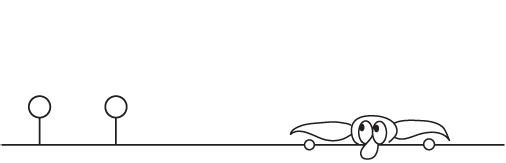

PCFG = Probabilistic Context Free Grammar

PCFG = Pretty Cool Fuzzy Guesser

In short: A collection of tools to perform research into how humans generate passwords. These can be used to crack password hashes, but also create synthetic passwords (honeywords), or help develop better password strength algorithms

**Version:** 4.3

This project uses machine learning to identify password creation habits of users. A PCFG model is generated by training on a list of disclosed plaintext/cracked passwords. In the context of this project, the model is referred to as a ruleset and contains many different parts of the passwords identified during training, along with their associated probabilities. This stemming can be useful for other cracking tools such as PRINCE, and/or parts of the ruleset can be directly incorporated into more traditional dictionary-based attacks. This project also includes a PCFG guess generator that makes use of this ruleset to generate password guesses in probability order. This is much more powerful than standard dictionary attacks, and in testing has proven to be able to crack passwords on average with significantly less guesses than other publicly available methods. The downside is that generating guesses in probability order is slow, meaning it is creating on average 50-100k guesses a second, where GPU based algorithms can create millions to billions (and up), of guesses a second against fast hashing algorithms. Therefore, the PCFG guesser is best used against large numbers of salted hashes, or other slow hashing algorithms, where the performance cost of the algorithm is made up for with the accuracy of the guesses.

This Developer's Guide was written for three different audiences:

1. Power users who want to take full advantage of the PCFG configuration options, or want to manually modify rulesets
2. Developers who want to add or extend PCFG features
3. Developers who want to create their own password cracking tools

To this end, this Developer's Guide will contain a mix of feature descriptions, underlying code documentation, and password cracking theory. Part of the drive to document this code is I'm not doing much development with this tool. It's been two years since the last major update, and I want to make this easier for other people (you) to pick this up and modify it to fit your own needs.

If you have any suggestions or changes please don't hesitate to reach our or to submit a merge request.
