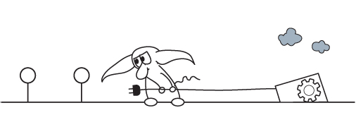
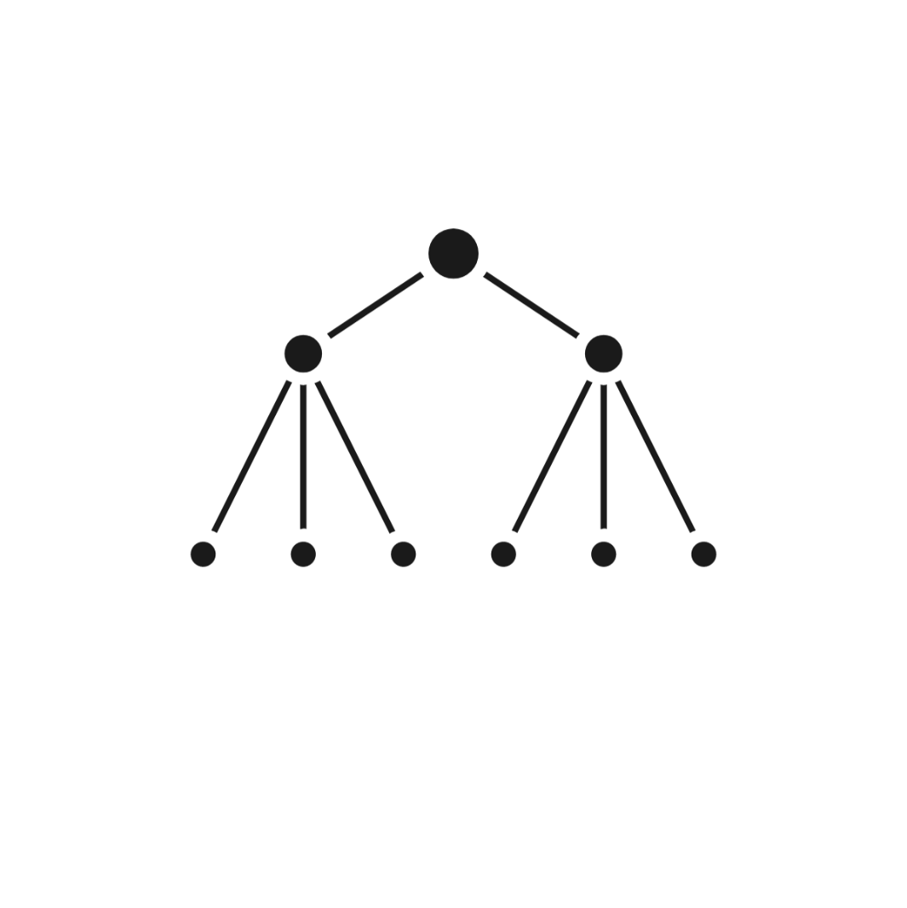
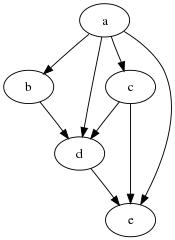
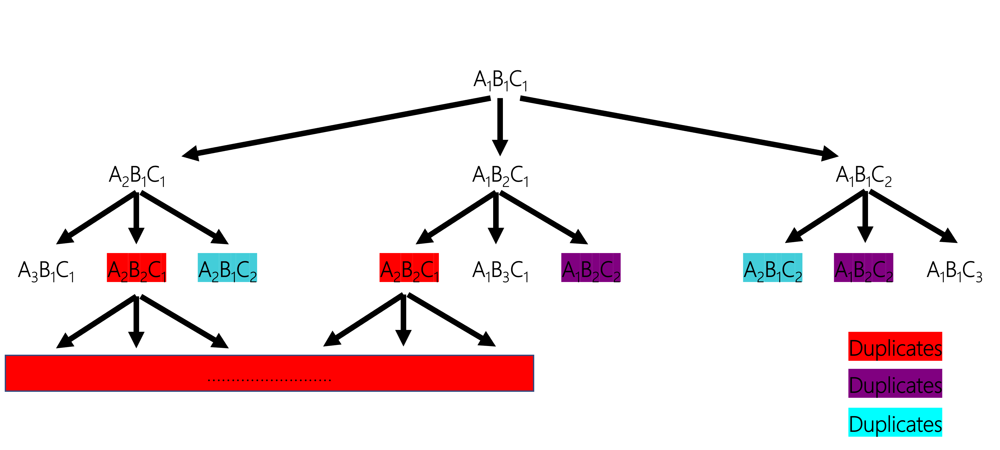
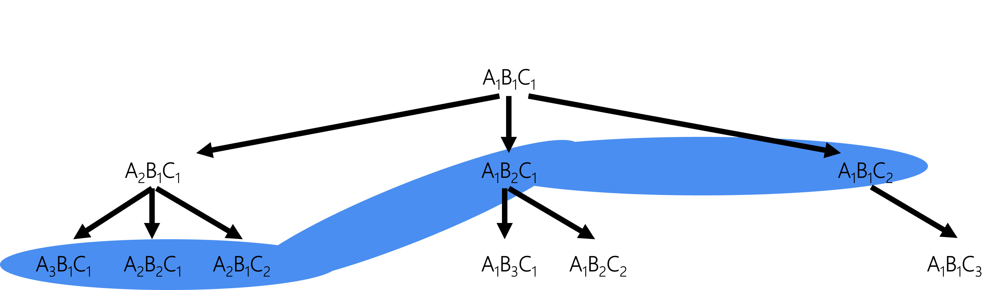
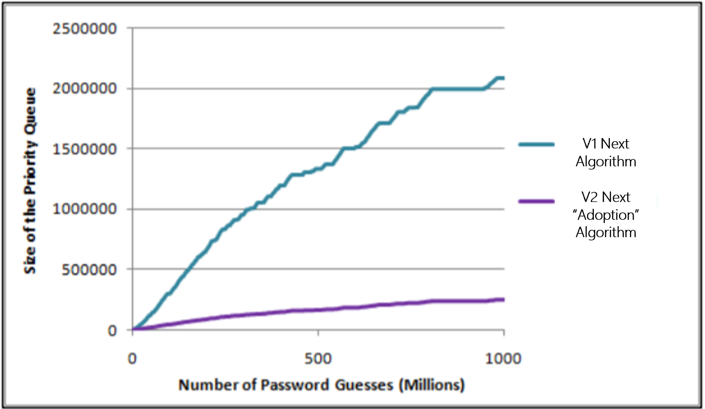

  
This section of the Developer's Guide is geared for researchers and developers and focuses on the "Next" algorithm which is the core algorithm behind the PCFG guesser. In a nutshell, the "Next" algorithm determines what the next guess to generate should be for a given PCFG. The current Next algorithm in the PCFG is tailored to generating guesses in probability order. This means it'll start by generating the most probable guess, followed by the second most probable guess, and so on. That is great for a password cracking attack, but it has some significant performance downsides. Which is another way of saying it is slow and requires increasing memory the longer it is run. Now not all Next algorithms have to follow this path, which is why this is a good area for improvements. For example a limit based Next algorithm that generates guesses in "mostly" probability order might have much better performance characteristics.

  
Definitions:
------------

1. **PCFG**: Probabilistic Context Free Grammar

2. **Probabilistic**: Every transition has a probability associated with it
  
3. **Context-Free**: Individual transitions do not impact each other
  
  - Normally this is desired since in passwords the base word is often independent of the other mangling rules.
    
    - E.g. 'Monkey' + '123'
      
  - Sometimes you want to add context though. For example, create a password guess exactly 7 characters long. There are ways to design a PCFG to model these requirements and add some "context" if desired..
    
4. **Grammar**: This is a model. Much like how a sentence can be constructed, so can a password. The grammar is the model that is being used.

5. **Transition**: Replacing one value in a PCFG generated string with another while following the rules of the grammar

  - An example of that may be taking the PCFG value "Password" + D2, and rewriting it as "Password25". In this case the D2 transitions to the number "25".

6. **Terminal**: A final guess/string generated by a PCFG. Once a terminal is created it is ready to be sent to whatever is using the program.
    
  - An example terminal might be 'Password123' or 'Super!Secret182'
  
7. **Pre-Terminal**: A PCFG value where there still remain transitions to take

  - Going back to the previous example "Password" + D2 would be classified as a pre-terminal. Likewise A8D2 would also be an earlier pre-terminal, with it represented as an 8 letter alpha word, followed by two digits.
  
8. **S**: This is the Starting pre-terminal. All transitions in the PCFG start from S.

9. **Parse Tree**: A record of all the transitions required to move from **S** to a given terminal.
  
Assumptions:
------------

1. The transitions in the grammar are non-ambiguous

  - By this, no transitions share the same replacement

    -E.g: Not allowed: Trans1 -> ReplacementA; Trans2 -> ReplacementA

  - Disclaimer: In practice, most password based grammars are ambiguous due to features like representing keyboard walks. For the purposes of discussing the "Next" algorithm though, we're going to ignore those.

2. The grammar does not contain recursion

  - There are no loops

    - E.g: Not allowed: Trans1 -> Trans2 -> Trans1;

  - Disclaimer: Support for recursion was actually included in the PCFGv3 implementation. It adds a lot of complexity, and recursion was never made use of in the password grammar, so for this guide we're going to ignore it.
  
3. When multiple transitions occur before a final terminal (excluding the first transition from 'S'), the following transition type occurs universally to the previous transition

  - This is a huge restriction, and made to simplify the implementation of the "Next" function
  
  - Think case-mangling. S -> ['cat', dog', 'rat']. Now you want to apply case mangling to those alpha strings. It is easier to represent that case mangling as a mask vs. having to have a separate transition for each individual word.
  
    - E.g. S -> ['cat', 'dog', 'rat'] x ['LLL', 'ULL', 'UUU']
    
    - This would normally be represented in a more traditional PCFG as 'cat' -> ['cat', 'Cat', 'CAT']
    
    
General Documentation Conventions:
----------------------------------

1. A PCFG transition will be represented by a capital letter

  - Example: 'A'
  
  - Note, this is different from how base structures are handled in the current grammar where the transitions are usually represented a capital letter followed by a number indicating how long the transition's word/digit/string is. I'm simplifying that out for this discussion about "Next" functions so this number doesn't get confused for the probability order number which is represented as a subscript.

2. Transitions are followed by by a subscript of the current replacement ordered by probability

  - Example: 'A\ :sub:`1`\' for the most probable, 'A\ :sub:`2`\' for the second most probable, and so on.
  
3. Based on Assumption #3, transitions are applied universally so they can be written expanded out

  - Example: For case mangling 'A\ :sub:`1`\B\ :sub:`2`\' could represent the most common word with the second most common case mangling mask applied to it.
  
Desired Goals of the "Next" Algorithm:
--------------------------------------

1. Only generate a parse tree once

  - This is another way of saying avoid making duplicate guesses
  
2. Generate parse trees in probability order

  - Start by generating the most probable terminal/guess first, then the second most probable one, and so on.
   
3. Minimize memory and running time requirements

Note: Achieving all three goals at once remains an open problem.

Current Approaches for Designing a "Next" Algorithm:
----------------------------------------------------

At a high level, all the current approaches for designing a Next function for a PCFG based password cracker rely upon turning the PCFG into a tree search problem.

- Once you do this, you can start to apply traditional search techniques such as Depth First Search (DFS), Breadth First Search (BFS), etc.
    

  
- This may seem like a fairly straightforward representation but it probably took me over a year of my PhD research to think of this optimization.

- Now technically a PCFG is not a Tree. By default it is better represented as a Directed Acyclic Graph (DAG). If you squint these may look a lot like a tree but way more complicated.

- "More complicated" is usually not a good thing when designing algorithms. Therefore steps need to be taken to simplify the PCFG DAG into a Tree.

- If I had to sum up my PhD defense in the most boring way possible, it was that I took a Probability DAG, created an algorithm to convert it into a Probability Tree, and then used a priority queue to perform a BFS walk of the tree which generated all the terminals in probability order. I then called this a password cracker.

- What this means is that there really are two steps in the "Next" algorithm. 1) Converting a DAG into a Tree, 2) Performing BFS of the tree. Both steps has lots of room to be optimized. For example, if you don't care about generating guesses in true probability order, there are a number of Depth First Search (DFS) optimizations you can use instead of BFS.

Challenges Traversing a PCFG as a Tree:
~~~~~~~~~~~~~~~~~~~~~~~~~~~~~~~~~~~~~~~~~~~~~~~

Lets consider a PCFG grammar as a Tree with the root node being A\ :sub:`1`\B\ :sub:`1`\C :sub:`1`\. I'm ignoring the **S** pre-terminal for the sake of convenience, but you can mentally put it above the root node if you want to. If we continue to build this grammar out as a tree with each lower probability transition being a leaf, the following will usually occur:

  
As you can see, many leafs are effectively duplicates of each other. This is why you usually see PCFGs represented as a DAG instead of a Tree. This also causes problems for our "Next" function since duplicates are something we want to avoid if possible. Therefore most of the discussion you'll see about converting a DAG to a Tree will focus on how to "trim" branches of the tree above to eliminate duplicate guesses.

PCFG v0 Next Algorithm:
~~~~~~~~~~~~~~~~~~~~~~~~~

The very first approach we took when investigating if PCFGs could be used to represent human generated passwords was to generate all possible passwords up to a given probability, save them to disk, sort them in probability order, and then print them. This effort was lead by Bill Glodek and was the basis for his Thesis. The actual algorithm is described in section 3.4.2 of his Thesis, and the code is in the Appendix of his Thesis, but let me try and simplify the description for this guide:

- Since the guesses are sorted after the fact and do not need to be generated in order, branches can be trimmed off the DAG so each variable can be incremented from left to right. So for example, guesses can be generated as:

  - A\ :sub:`1`\B\ :sub:`1`\C :sub:`1`\
  
  - A\ :sub:`2`\B\ :sub:`1`\C :sub:`1`\
  
  - A\ :sub:`3`\B\ :sub:`1`\C :sub:`1`\
  
  - A\ :sub:`1`\B\ :sub:`2`\C :sub:`1`\
  
  - A\ :sub:`2`\B\ :sub:`2`\C :sub:`1`\
  
  - A\ :sub:`3`\B\ :sub:`2`\C :sub:`1`\
  
  - A\ :sub:`1`\B\ :sub:`3`\C :sub:`1`\
  
  - ...
  
- Disclaimer: I'm not entirely sure the above is exactly the way the code looped through the generation process as I'd need to look at the code in more detail to verify the algorithm. But the general idea should hold up.

- While we hadn't defined it as such at the time, the above idea uses the idea of a "pivot" point to prune branches and eliminate duplicate guess generation. This was expanded out in the Version 1 "Next" algorithm for the PCFG.

The upside of this approach is that it is simple. Also, once the initial wordlist is generated/sorted it can be used by any other password cracking tool. More importantly, the cost of generating this wordlist is a one time cost! Therefore you can think of it as a time/memory trade-off as you are only doing the computations once and using a ton of disk space to cache the results for future cracking attacks.

The challenge is the memory requirements are onerous as you need to save then sort every single guess before you even start a password cracking attack. If you don't mind terabytes of wordlists, and spending hours/days generating the initial wordlist, this approach is still totally viable.

PCFG Next Algorithm v1:
~~~~~~~~~~~~~~~~~~~~~~~

The PCFG "Next" algorithm version 1 is the approach described in the original PCFG S&P paper. It rests on the idea of assigning a pivot value to each node to prune branches and convert a DAG to a Tree. The pivot value specifies what children/leafs can be created by a particular node. A child can only be created if the transition position is equal to or greater than the pivot value. So for example, a root node of A\ :sub:`1`\B\ :sub:`1`\C :sub:`1`\ would be assigned a pivot value of 0, which means it can create children for all of its transitions. Its child A\ :sub:`2`\B\ :sub:`1`\C :sub:`1`\ would likewise inherit the pivot value of 0 and could create all of its own children as well. On the other hand, the child A\ :sub:`1`\B\ :sub:`2`\C :sub:`1`\ would be assigned a pivot value of 1, since it was created by incriminating the second transition. Therefore it could only create children for its B and C transition. Therefore it creates trees such as the one below:

  
Once the PCFG has been converted to a Tree, the next step is to use it to generate guesses in probability order. The easiest way to do that with a priority queue. The priority queue is initialized with the root node in it. You then pop the most probable node off the queue, generate guesses from it, and then push all the children from that node back into the queue. This continues until you've cracked the password, or you run out of nodes to traverse. Therefore the priority queue will hold all of the nodes of the current breadth first search of the Tree. This can be seen in the following diagram.

The reason why this is the Version 1 of the "Next" algorithm and not just the "Next" algorithm can be summed up by the term: "memory usage". To put it simply, a lot of very low probability nodes get pushed into the priority queue which causes it to expand very fast because the tree is so heavily weighted to the leftmost nodes. Looking back to the previous picture of the Tree, you can see a node on the left will have significantly more children than the right side. This means that when one of those nodes gets popped and its children get pushed onto the priority queue this may include a lot of very low probability children that will hang out in the priority queue for a significant amount of time. Think of those nodes as a trust fund children that are able to show up simply because their parents had a high probability, and they just hangs out in the priority queue not contributing anything and taking up resources.

PCFG Next Algorithm v2 (Adoption Algorithm):
~~~~~~~~~~~~~~~~~~~~~~~~~~~~~~~~~~~~~~~~~~~~

The second version of the "Next" algorithm is the Adoption algorithm. I originally called the "Deadbeat Dad" algorithm, but I'm regretting the negative connotations so I'm renaming it. The key idea behind this approach is that a node can have multiple different parents (that old DAG vs. Tree issue), so a child should only be pushed into the priority queue if its least most probable parent was just popped from the queue. This relies on the assumption that a child's probability can't be greater than its parents. In the current PCFG code, this approach is implemented by generating all the children for any node popped from the queue, and then walking back up the Tree/DAG and generating all the parents for those children. If a child has a lower probability parent than the parent that was just popped, it is left for that lower probability parent to "adopt" that child later. If the recently popped parent is the lowest probability parent for a child node though, that child is then pushed into the priority queue. Ties in parent probability are resolved by the arbitrary but deterministic approach of selecting the rightmost node to be the parent. Admittedly this approach requires a lot more computation than the Version 1 "Next" algorithm. The memory savings and correspondingly faster priority queue pushes make the Version 2 approach better algorithm for most use-cases though. This can be seen in the following graph.

  
  
Suggested Research Areas and Open Questions:
----------------------------------------------------

The current Version 2 "Adoption" algorithm is computationally expensive and even though its memory usage is better than the Version 1 "Next" algorithm, it still grows quite large for longer cracking sessions. Therefore there is still a lot of room for improvement when it comes to weaponizing a PCFG for use in password cracking attacks.

Improving the Breadth First Search (Priority Queue):
~~~~~~~~~~~~~~~~~~~~~~~~~~~~~~~~~~~~~~~~~~~~~~~~~~~~~~
- There’s been a lot of research into better BFS algorithms in the last ten years since the v2 “next” algorithm was written
- There’s some promising approaches beyond using a PQ
- Lots of improvements are possible, but memory management is still a running concern for alternate BFS implementations that I’ve looked at
- Long story short, this is a problem that I keep expecting to have been solved in other contexts, either in general tree BFS, DAG BFS, or PCFG BFS
- Memory management is a killer. Most “AI” solvers I’ve looked at tend to use a combination of Depth First Search (DFS) and BFS to compensate
- If you come up with a better solution, I will be **very** interested in it

Other Approaches:
~~~~~~~~~~~~~~~~~~

- Dropping the “Probability Order” Requirement

  - If you no longer care about generating guesses in true probability order, there are multitude of **much** faster “Next” algorithms you can use.

  - Basically you are no longer using BFS. Other approaches can be using DFS which has very limited memory and computational requirements.
  
  - This can be seen in John the Ripper’s –Markov mode
  
- Dropping “Probability" Altogether

  - Rather than calculate the true probability of each PCFG terminal, you can quantize each transition and use addition + limits, much like OMEN and JtR’s –Markov algorithm.
  
  - Now you are doing addition of INTs, vs. multiplication of FLOATs, which speeds things up.
  
  - In fact, PCFGs can use the underlying algorithm in OMEN with very little modification. Instead of length, choose a base structure as a starting point. Since the CF in PCFG stands for “context free” this allows for even more optimizations compared to other Markov based approaches

Summary:
~~~~~~~~

- There’s a lot of ways to generate guesses with Context Free Grammars

- The speed/memory trade-offs occur when specifying requirements for generating probable guesses first

- Most other current guessing algorithms can be adapted to use Context Free Grammars if desired

- Feel free to think outside the box. Don’t let current implementations that utilize pqueues and large memory requirements limit your thinking!

