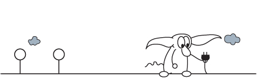

  

Original 2009 IEEE Security and Privacy paper on PCFGs for password
cracking: https://ieeexplore.ieee.org/abstract/document/5207658

My 2010 dissertation which describes several advanced features such as
the updated “next” algorithm:
https://diginole.lib.fsu.edu/islandora/object/fsu%3A175769

Bill Glodek's Thesis which detailed an earlier version of this tool. "Using a Specialized Grammar to Generate Probable Passwords" Authors: Bill Glodek: https://diginole.lib.fsu.edu/islandora/object/fsu:182401

Comparative Analysis of Three Language Spheres: Are Linguistic and
Cultural Differences Reflected in Password Selection Habits? Authors:
Keika Mori, Takuya Watanabe, Yunao Zhou, Ayako Akiyama Hasegawa,
Mitsuaki Akiyama and Tatsuya Mori:
https://nsl.cs.waseda.ac.jp/wp-content/uploads/2019/07/EuroUSEC19-mori.pdf  

OMEN: Faster Password Guessing Using an Ordered Markov Enumerator. Authors: Markus Duemut, Fabian Angelstorf, Claude Castelluccia, Daniele Perito, Abdelberi Chaabane: https://hal.archives-ouvertes.fr/hal-01112124/file/omen.pdf