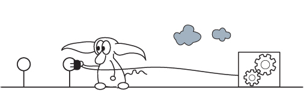

  
Overview:
---------

The PCFG trainer is the core of the PCFG toolset. The trainer determines what the grammar looks like, and how subsequent tools and attacks model human generated password creation strategies. Areas of innovation include:

- New mangling rules can be added to the trainer. For example, l33t sp33k substitution could be implemented.

- Probability smoothing could be applied to reduce the amount of transitions. For example, if a transition A is found 10002 times in the training set, and transition B is found 10003 times in the training set, the trainer could smooth their probabilities so they occur with the same frequency in the generated grammar. This can significantly speed up cracking attacks using the grammar

- Coverage can also be determined by the trainer. Aka how often do you try transitions that were not seen in the training set. For example, if the number '18632' is not in the training set, you may still want your grammar to generate it at a low probability.

- Finally existing mangling rule detection can be improved. For example the keyboard walk detection currently has a lot of false positives, while at the same time it only detects walks without gaps. Therefore it would detect '1qaz' as a keyboard walk, but it would not detect '1z2x3c'

Unit Testing:
-------------

There currently are a number of unittests built for the PCFG trainer. This is a good way to ensure that when code is modified that the rest of the functionality works as expected. As a request on my end, if you submit a merge request that modifies the PCFG trainer code, that you run the unittests before hand, and also add or modify unittests as needed. The number of bugs I've caught with these unit tests is significant enough that I'm super glad I took the time to write them.

To run the unittests:

1. From the top level pcfg_cracker directory run: `python3 -m unittest`

  - Note: Change "python3" to whatever name you use for your python 3 environment
  
2. Some of the tests are "noisy" as I haven't figured out how to suppress their outputs to stdout, but the last two lines you should see 70+ unit tests ran successfully with an "OK" in the last line. If you encounter any errors that implies some of the training functionality has become broken.

3. If you want to add or modify any unit tests you can find them in the: pcfg_cracker\lib_trainer\unit_tests directory

  - All current Unit Tests are written with the Python unittest module.

Understanding the Current Training Process:
-------------------------------------------

Looping Through The Input List
~~~~~~~~~~~~~~~~~~~~~~~~~~~~~~

When thinking about where to start when describing the current PCFG training process, the first thing that pops into my head is talking about how it loops through the training set multiple times. Each pass through the training set allows the trainer to learn more which then help inform future passes and training techniques. Below is a high level description of what it does in each pass:

- **(Pre-training Phase)**:

  - If the --encoding flag is not passed to the trainer, the first thing it does is read through a subset of the training set and attempt to auto-detect the encoding of the training file by using the chardet python package. It then interprets all subsequent passes through the training set using this character encoding
  
  
- **First Pass**: This pass is meant to learn all the base features of the training set that more traditional "mangling" detection rules can utilize. Therefore this run happens prior to any PCFG grammar transitions being created/learned/defined.

  - The trainer identifies individual words to use in multi-word detection
  
  - The trainer identifies the alphabet to use for constructing Markov chains
  
  - Duplicate password detection is performed. Duplicates a good, so if no duplicates are found in the training set it can print an warning to the user of this tool. In the future, this may also be used in some of the probability smoothing functionality.
  
 
- **Second Pass**: This pass is where the core grammar for the PCFG is created from the training set

  - All of the base structures and non-Markov transitions are identified and assigned a probability in this pass. For example it learns the base structure masks, such as "A3D2", and probabilities such as "A3" -> "cat" at 20%.
  
  - The trainer also learns NGrams for Markov based transitions. It is currently using the OMEN algorithm for this.
  
- **Third Pass**: In this pass it re-runs through the training list to perform any post-processing that may be necessary

  - The trainer learns what Markov (OMEN) probabilities the training passwords would be created at. This is an OMEN specific task to assign probabilities to each of the different OMEN levels
  
- **(Final Summary)**: Once all the passes through the training set are performed the following happens

  - The PCFG grammar is finalized and written to disk
  
  - "Interesting" statistics are printed to the screen. Ultimately I'd like to expand these so that the trainer could be used as an alternative to PACK.
  
Learning Mangling Rules
~~~~~~~~~~~~~~~~~~~~~~~

The "pcfg_parser" is the top level object/class that takes as input each individual word from the training set and then identifies the mangling rules associated with it. During this stage, each input password is parsed independently from other training passwords, which is why all the pre-processing needs to happen before this.

- The current PCFG grammar's root nodes are centered around the idea of "base structures" These are high level definitions of what type of transition to take for each chunk of the password. Initially a "section_list" that represents this base structure is initialized to be undefined for the length of the training password. What that means is that every character in the training password is initialized as "undefined" as the trainer does not know how it was generated.

- The pcfg_parser performs mangling detection in a pre-defined order, so earlier mangling detection techniques have priority over later techniques. This is important because different mangling detection techniques can identify the same strings in the training password differently.

  - For example, the keyboard walk detection might identify the string '1qaz' as a keyboard walk
  
  - By default the Alpha and Digit detection would classify '1qaz' as a D1A3 (One digit followed by a three letter word)
  
  - Therefore its important that the keyboard walk detection occurs before the Alpha and Digit detection and takes precedence over them.

- As a string/sub-section of the training input is classified, it updates the "section_list" with that classification. Therefore subsequent mangling detection techniques are only run against the undefined sub-sections.

  - One key point is that even though the current mangling detection techniques skip portion of the "section_list" that are defined, that doesn't mean that **your** mangling techniques need to skip or ignore those. The data is available so if you can make use of it please don't hesitate to do so.
  
- At the end of the processing, "Other" string detection is run as a clean-up/default option. Any undefined "section_list" portions are classified as "Other".