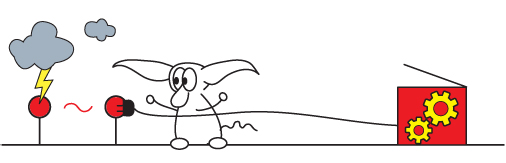

trainer.py
----------
.. automodule:: trainer
   :members:
   :noindex:
   
banner_info.py
--------------
.. automodule:: lib_trainer.banner_info
   :members:
   :noindex:
   
base_structure.py
------------------
.. automodule:: lib_trainer.base_structure
   :members:
   :noindex:
   
calculate_probabilities.py
---------------------------
.. automodule:: lib_trainer.calculate_probabilities
   :members:
   :noindex:
   
config_file.py
--------------
.. automodule:: lib_trainer.config_file
   :members:
   :noindex:

pcfg_password_parser.py
------------------------
.. automodule:: lib_trainer.pcfg_password_parser
   :members:
   :noindex:
   
prince_metrics.py
------------------
.. automodule:: lib_trainer.prince_metrics
   :members:
   :noindex:
   
print_statistics.py
--------------------
.. automodule:: lib_trainer.print_statistics
   :members:
   :noindex:
   
run_trainer.py
--------------
.. automodule:: lib_trainer.run_trainer
   :members:
   :noindex:
   
save_pcfg_data.py
------------------
.. automodule:: lib_trainer.save_pcfg_data
   :members:
   :noindex:
   
trainer_file_input.py
----------------------
.. automodule:: lib_trainer.trainer_file_input
   :members:
   :noindex:
   
trainer_file_output.py
-----------------------
.. automodule:: lib_trainer.trainer_file_output
   :members:
   :noindex:
   
alpha_detection.py
-----------------------
.. automodule:: lib_trainer.detection_rules.alpha_detection
   :members:
   :noindex:
   
context_sensitive_detection.py
-------------------------------
.. automodule:: lib_trainer.detection_rules.context_sensitive_detection
   :members:
   :noindex:
   
digit_detection.py
-----------------------
.. automodule:: lib_trainer.detection_rules.digit_detection
   :members:
   :noindex:

email_detection.py
-----------------------
.. automodule:: lib_trainer.detection_rules.email_detection
   :members:
   :noindex:

keyboard_walk.py
-----------------------
.. automodule:: lib_trainer.detection_rules.keyboard_walk
   :members:
   :noindex:
   
multiword_detector.py
-----------------------
.. automodule:: lib_trainer.detection_rules.multiword_detector
   :members:
   :noindex:

other_detection.py
-----------------------
.. automodule:: lib_trainer.detection_rules.other_detection
   :members:
   :noindex:
   
tld_list.py
-----------------------
.. automodule:: lib_trainer.detection_rules.tld_list
   :members:
   :noindex:

website_detection.py
-----------------------
.. automodule:: lib_trainer.detection_rules.website_detection
   :members:
   :noindex:
   
year_detection.py
-----------------------
.. automodule:: lib_trainer.detection_rules.year_detection
   :members:
   :noindex:
   
alphabet_generator.py
-----------------------
.. automodule:: lib_trainer.omen.alphabet_generator
   :members:
   :noindex:
   
alphabet_lookup.py
-----------------------
.. automodule:: lib_trainer.omen.alphabet_lookup
   :members:
   :noindex:
   
evaluate_password.py
-----------------------
.. automodule:: lib_trainer.omen.evaluate_password
   :members:
   :noindex:
   
omen_file_output.py
-----------------------
.. automodule:: lib_trainer.omen.omen_file_output
   :members:
   :noindex:

smoothing.py
-----------------------
.. automodule:: lib_trainer.omen.smoothing
   :members:
   :noindex: